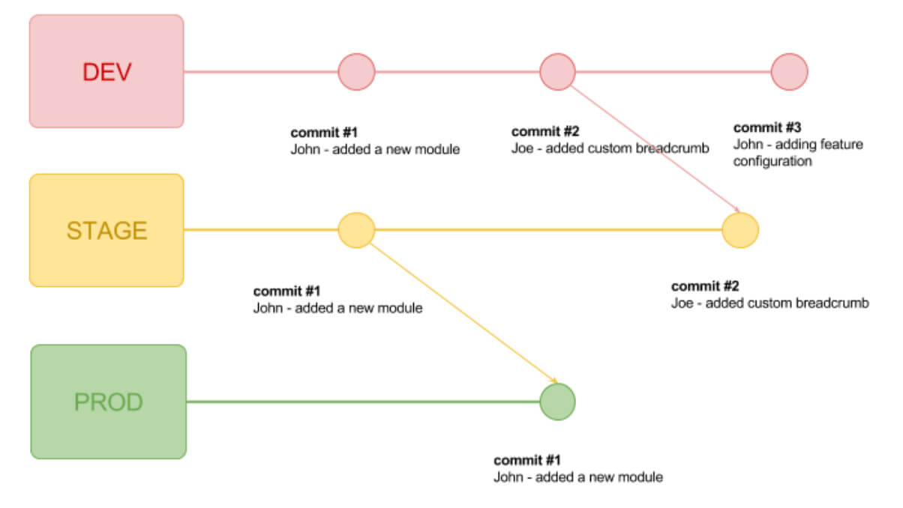

# gitlab-flow

This is a sample repo following the **gitlab-flow** practice.

There are 3 GitHub Actions workflows:

1. `ci-dev.yml`: performs CI when changes are pushed to the `dev` branch.
2. `deploy-prod.yml`: build and push Docker image when changes are pushed to the `prod` branch
3. `pr-test.yml`: performs testing whenever a Pull Request is opened.
